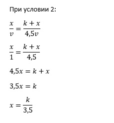

---
# Front matter
title: "Отчет по лабораторной работе №2"
subtitle: "Задача о погоне"
author: "Бурдина Ксения Павловна"
group: NFIbd-01-19
institute: RUDN University, Moscow, Russian Federation
date: 2022 Feb 17th

# Generic otions
lang: ru-RU
toc-title: "Содержание"

# Bibliography
csl: pandoc/csl/gost-r-7-0-5-2008-numeric.csl

# Pdf output format
toc: true # Table of contents
toc_depth: 2
lof: true # List of figures
lot: true # List of tables
fontsize: 12pt
linestretch: 1.5
papersize: a4
documentclass: scrreprt
### Fonts
mainfont: PT Serif
romanfont: PT Serif
sansfont: PT Sans
monofont: PT Mono
mainfontoptions: Ligatures=TeX
romanfontoptions: Ligatures=TeX
sansfontoptions: Ligatures=TeX,Scale=MatchLowercase
monofontoptions: Scale=MatchLowercase,Scale=0.9
## Biblatex
biblatex: true
biblio-style: "gost-numeric"
biblatexoptions:
  - parentracker=true
  - backend=biber
  - hyperref=auto
  - language=auto
  - autolang=other*
  - citestyle=gost-numeric
## Misc options
indent: true
header-includes:
  - \linepenalty=10 # the penalty added to the badness of each line within a paragraph (no associated penalty node) Increasing the value makes tex try to have fewer lines in the paragraph.
  - \interlinepenalty=0 # value of the penalty (node) added after each line of a paragraph.
  - \hyphenpenalty=50 # the penalty for line breaking at an automatically inserted hyphen
  - \exhyphenpenalty=50 # the penalty for line breaking at an explicit hyphen
  - \binoppenalty=700 # the penalty for breaking a line at a binary operator
  - \relpenalty=500 # the penalty for breaking a line at a relation
  - \clubpenalty=150 # extra penalty for breaking after first line of a paragraph
  - \widowpenalty=150 # extra penalty for breaking before last line of a paragraph
  - \displaywidowpenalty=50 # extra penalty for breaking before last line before a display math
  - \brokenpenalty=100 # extra penalty for page breaking after a hyphenated line
  - \predisplaypenalty=10000 # penalty for breaking before a display
  - \postdisplaypenalty=0 # penalty for breaking after a display
  - \floatingpenalty = 20000 # penalty for splitting an insertion (can only be split footnote in standard LaTeX)
  - \raggedbottom # or \flushbottom
  - \usepackage{float} # keep figures where there are in the text
  - \floatplacement{figure}{H} # keep figures where there are in the text
---

# Цель работы

Целью данной работы является построение математической модели для дальнейшего решения задачи о погоне на примере задачи преследования браконьеров береговой охраной.

# Задание

В ходе работы необходимо:

1. Выполнить расчёты и вывести уравнение движения катера при условии, что расстояние в момент обнаружении лодки составляет 15.5 км от катера, а скорость катера превышает скорость лодки в 4.5 раза.

2. Построить траекторию движения катера и лодки для двух случаев, в зависимости от начального положения катера относительно полюса.

3. Найти по графику точку пересечения траектории движения катера и лодки.

# Теоретическое введение

Постановка задачи следующая:

На море в тумане катер береговой охраны преследует лодку браконьеров. Через определенный промежуток времени туман рассеивается, и лодка обнаруживается на расстоянии 15.5 км от катера. Затем лодка снова скрывается в тумане и уходит прямолинейно в неизвестном направлении. Известно, что скорость катера в 4.5 раза больше скорости браконьерской лодки.

Решение исходной задачи сводится к решению системы из двух дифференциальных уравнений: 

$$ \left\{ 
\begin{array}{c}
\frac{dt}{dt} = v \\ 
r\frac{d\theta}{dt} = \sqrt(19.25)v \\ 
\end{array}
\right.$$

с начальными условиями: 

$$ \left\{ 
\begin{array}{c}
\theta = 0 \\ 
r = \frac{k}{5.5} \\ 
\end{array}
\right.$$

или 

$$ \left\{ 
\begin{array}{c}
\theta = -\pi \\ 
r = \frac{k}{3.5} \\
\end{array}
\right.$$

# Выполнение лабораторной работы

1. Принимаем за $t_0 = 0$, $x_{л0} = 0$ - место нахождения лодки браконьеров в момент обнаружения, $x_{k0} = 15.5$ - место нахождения катера береговой охраны относительно лодки браконьеров в момент обнаружения лодки.

2. Введем полярные координаты. Считаем, что полюс - это точка обнаружения лодки браконьеров $x_{л0}$, а полярная ось проходит через точку нахождения катера береговой охраны.

3. Заметим, что траектория катера должна быть такой, чтобы и катер, и лодка все время были на одном расстоянии от полюса $θ$, только в этом случае траектория катера пересечется с траекторией лодки.
Изначально катер береговой охраны двигается прямолинейно, а после того, как оказывается на том же расстоянии от полюса, что и лодка браконьеров, начинает двигаться вокруг полюса, удаляясь от него с той же скоростью, что и лодка браконьеров.

4. Чтобы найти расстояние $x$ (расстояние после которого катер начнет двигаться вокруг полюса), необходимо составить простое уравнение. Пусть через время $t$ катер и лодка окажутся на одном расстоянии $x$ от полюса. За это время лодка пройдет $x$, а катер $k - x$ (или $k + x$, в зависимости от начального положения катера относительно полюса). Время, за которое они пройдут это расстояние, вычисляется как $x/v$ или $k - x/ 4.5v$ (во втором случае $x+k/ 4.5v$). Так как время одно и то же, то эти величины одинаковы. Тогда неизвестное расстояние $x$ можно найти из следующих уравнений:
$\frac{x}{v} = \frac{k-x}{4.5v} \\$ для первого случая и $\frac{x}{v} = \frac{x+k}{4.5v} \\$ для второго случая.

При решении уравнений получаем следующие начальные условия для решения задачи:
$\left\{ 
\begin{array}{c}
\theta_0 = 0 \\
r_0 = \frac{k}{5.5} \\ 
\end{array}
\right.$ для первого случая и
$\left\{ 
\begin{array}{c}
\theta_0 = -\pi \\ 
r_0 = \frac{k}{3.5} \\
\end{array}
\right.$ для второго случая.

Видим, что значение $x_1 = \frac{k}{5.5}$, а значение $x_2 = \frac{k}{3.5}$.

В результате мы будем решать задачу для двух случаев.

Случай 1:

Случай 2:

5. После того, как катер береговой охраны окажется на одном расстоянии от полюса, что и лодка, он должен сменить прямолинейную траекторию и начать двигаться вокруг полюса, удаляясь от него со скоростью лодки $v$. Для этого скорость катера раскладываем на две составляющие: $v_r$ - радиальная скорость и $v_\tau$ - тангенциальная скорость. Радиальная скорость - это скорость, с которой катер удаляется от полюса, $v_r = \frac{dr}{dt}$. Нам нужно, чтобы эта скорость была равна скорости лодки, поэтому полагаем $\frac{dr}{dt} = v$. 
Тангенциальная скорость – это линейная скорость вращения катера относительно полюса. Она равна произведению угловой скорости $\frac{dθ}{dt}$ на радиус $r$, то есть $v_\tau = r\frac{d\theta}{dt}$.

По теореме пифагора получаем следующее уравнение:

$v_\tau = r\frac{d\theta}{dt} = \sqrt((4.5v)²-v²) = \sqrt(19.25)v$.

6. Решение исходной задачи сводится к решению системы из двух дифференциальных уравнений с начальными условиями. Исключая из полученной системы производную по $t$, можно перейти к следующему уравнению:

$$\frac{dr}{d\theta} = \frac{r}{\sqrt(19.25)}$$

Начальные условия остаются прежними. Решив это уравнение, мы получим траекторию движения катера в полярных координатах.

7. Напишем программу для расчёта траектории движения в SciLab. Зададим начальное растояние s = 15.5. В функции $dr$, которая описывает движение катера береговой охраны, укажем получившееся значение по формуле, а именно запишем значение константы, равное 19.25. Далее установим $r0=s/5.5$ и $tetha0=0$ (они были найдены в системе начальных условий для первого случая).

В результате выполнения данной программы получаем следующий график:

По графику видим, что траектории движения лодки и катера пересекутся на растоянии 7.2 км.

8. Теперь заменим в коде значения начальных условий при случае 1 для получения траектории движения в случае 2. Для этого зададим значения $r0=s/3.5$ и $tetha0=-%pi$ (они были найдены в системе начальных условий для второго случая).

В результате выполнения данной программы получаем следующий график:

По графику видим, что траектории движения лодки и катера пересекутся на растоянии 23 км.

# Выводы

В процессе выполнения работы мы построили математическую модель для решения задачи о погоне на примере задачи преследования браконьеров береговой охраной. Мы записали дифференциальные уравнения, описывающие движение катера, построили графики движения катера и лодки для двух случаев и нашли точки пересечения траекторий движения катера и лодки для двух случаев.

# Список литературы

1. Методические материалы курса "Математическое моделирование".

2. Куроткин В. И., Стерлигов В. Л. Самонаведение ракет. М. -Военное издательство Минобороны СССР: 1963, 88 с.